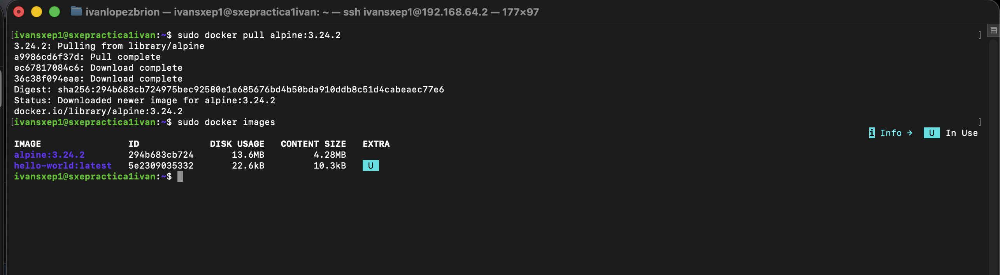
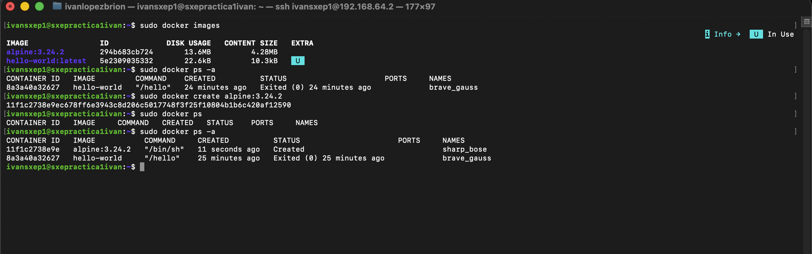
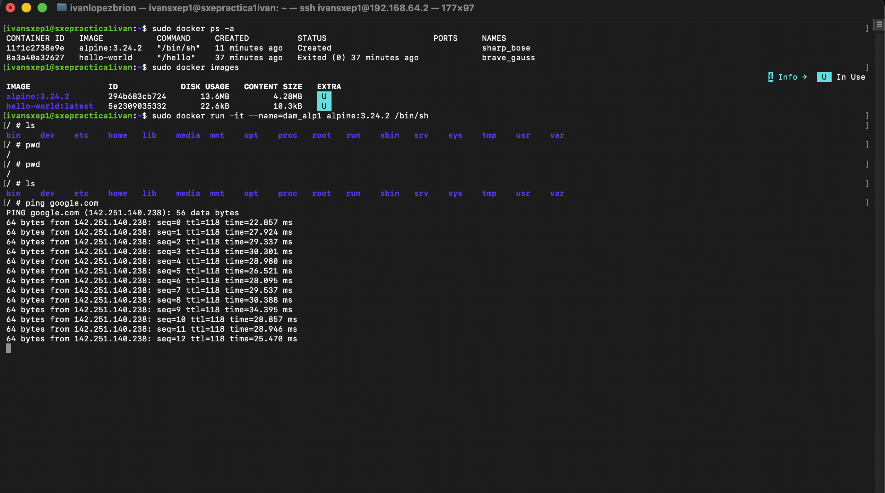
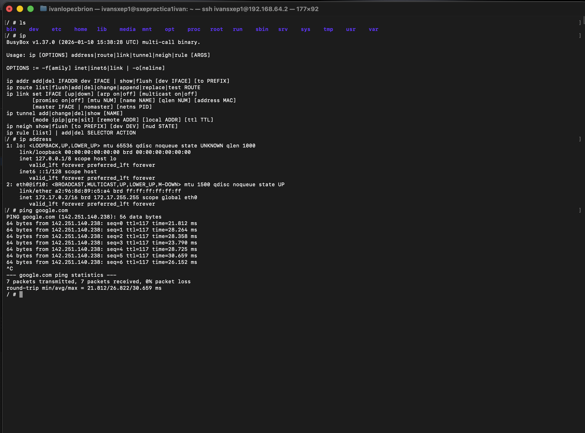
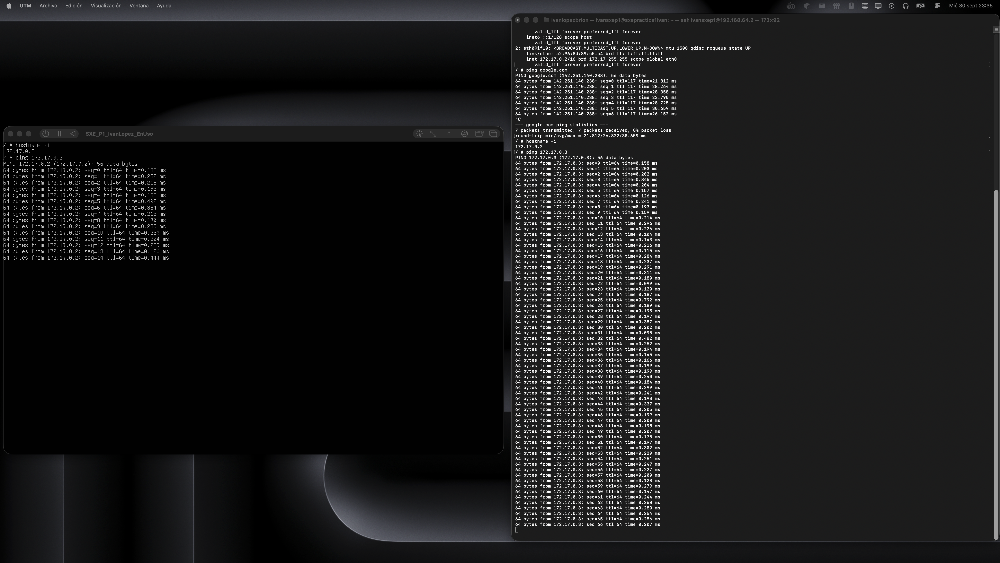
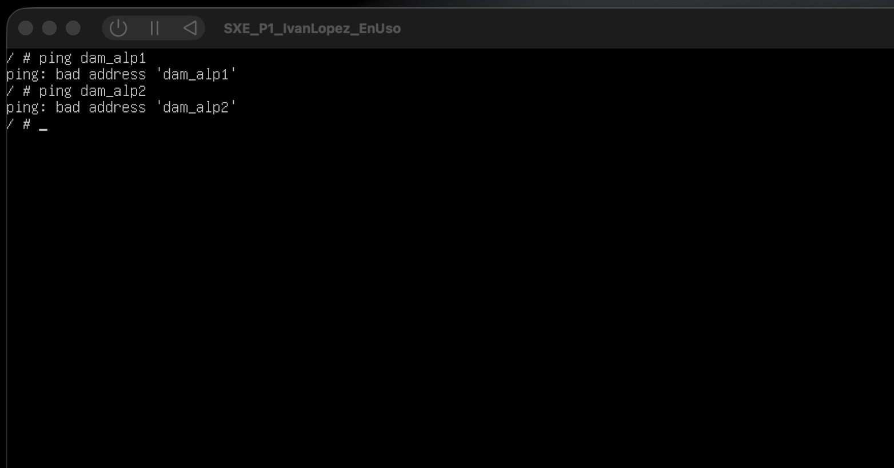
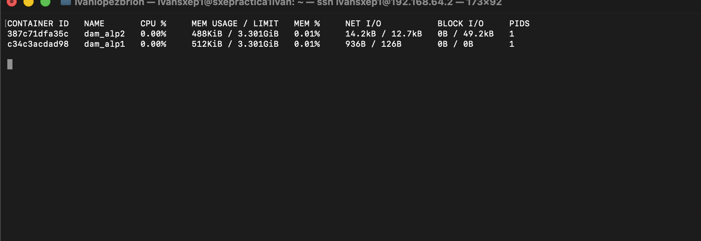
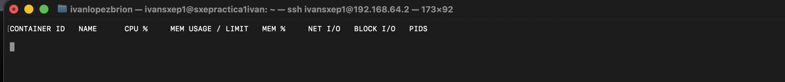
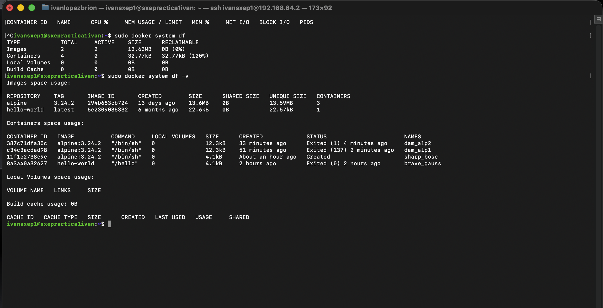

# Tarea 3
Respuestas a las preguntas planteadas en la tareas 3

## Pregunta 1:
> (Descarga la imagen de Alpine sin arrancarla y comprueba que la tienes. Fija la versión: no uses latest. Escoge una versión, de las disponibles en docker hub.)

## Pregunta 2:
> (Crea un contenedor sin nombre y sin arrancarlo. ¿En qué estado queda? ¿Qué nombre le ha puesto Docker?)

## Pregunta 3:
> (Crea y arranca dam_alp1 con una shell. ¿Qué opciones necesitas para poder escribir dentro?)

Para crear y arrancar juntos un contenedor de docker se usa `docker run`, y para añadirle una terminal necesitamos añadirle las opciones `-i` y `-t` las cuales son respectivamente usadas para poder interactuar con el contenedor y para insertar una seudo terminal, ejecutaremos el comando /bin/sh para crear un punto de partida de la termianl (si queremos abrir otra terminal una vez cerrado el contenedor tendremos que abrir otro proceso de terminal con `exec` en vez de con run).

El comando completo es: `sudo docker run -it --name=dam_alp1 alpine3.24.2 /bin/sh`

## Pregunta 4:
> (Desde dentro, mira qué IP tiene y si puede hacer ping a google.com.)

La IP de este contenedor es `172.17.0.2` y como se puede ver en la captura se conecta perfectamente a google.

## Pregunta 5:
> (Deja dam_alp1 funcionando sin pararlo y crea dam_alp2 igual. Con los dos en marcha, haz ping de uno a otro: por IP y por nombre. Explica cada resultado.)

Como se puede ver en la siguiente captura, la ip de **dam_alp2** es la misma que la de **dam_alp1** pero terminando en 3 por lo cual `172.17.0.3`. Y si hacemos ping de uno a otro mediante su ip se encuentran sin problema.

Sin embargo si intentamos hacer ping por nombre como podemos ver en la siguiente imagen no lo encuentra

Esto sucede porque los contenedores están aislados del resto de contenedores, no se pueden ver uno a otro como contenedores dentro de un equipo sino que son son instancias independientes de una imagen común, de la misma forma que 2 máquinas virtuales de ubuntu no se ven entre ellas por mucho que estén corriendo en el mismo dispositivo.

## Pregunta 6:
> (Con los dos en marcha, averigua cuánta memoria consumen. ¿Hay un comando de Docker para eso?)

Sí hay un comando de docker, `docker stats`

En la imagen de abajo podemos ver cuanta memoria está usando, está usando una cantidad completamente ridícula como se puede observar.

## Pregunta 7:
> (Sal con exit. ¿Qué les ha pasado? Repite el comando anterior: ¿qué ves ahora y por qué?)

Al salir de ambos contenedores y no haber usado la opción `-d (disatach)` al momento de hacer run ambos contenedores se han detenido por lo cual no consumen recursos.

## Pregunta 8:
> (¿Cuánto disco has ocupado? Distingue imágenes de contenedores.)

Para esto se usa el comando `docker system df`, podemos usar `-v (verbose)` para que nos de ás detalles y saber qué contenedor o imagen ocupa más.

Aquí se puede observar como las 2 imágenes que tengo descargadas en mi equipo ocupan juntas alrededor de 14 MB y los 4 contenedores alrededor de 33 kB.

Tiene lógica que la imagen de la que se crean los contenedores ocupe más que los propios contenedores en sí. Podemos observar que la imagen de alpine ocupa 13.6 MB mientras que cada una de sus instancias ocupa a penas 12.3 kB.